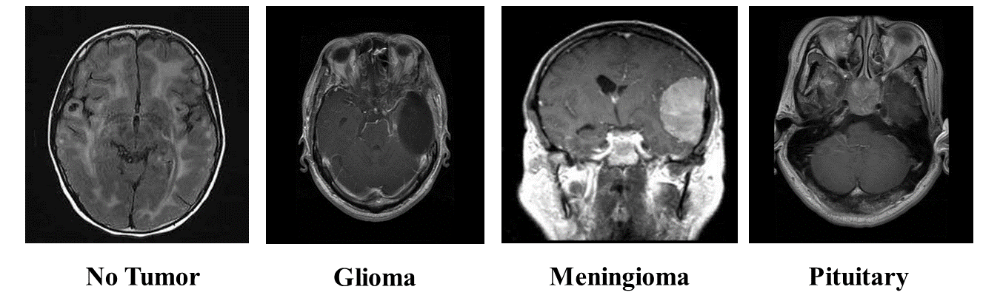
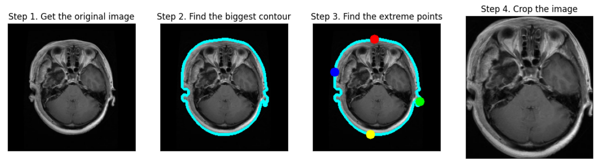
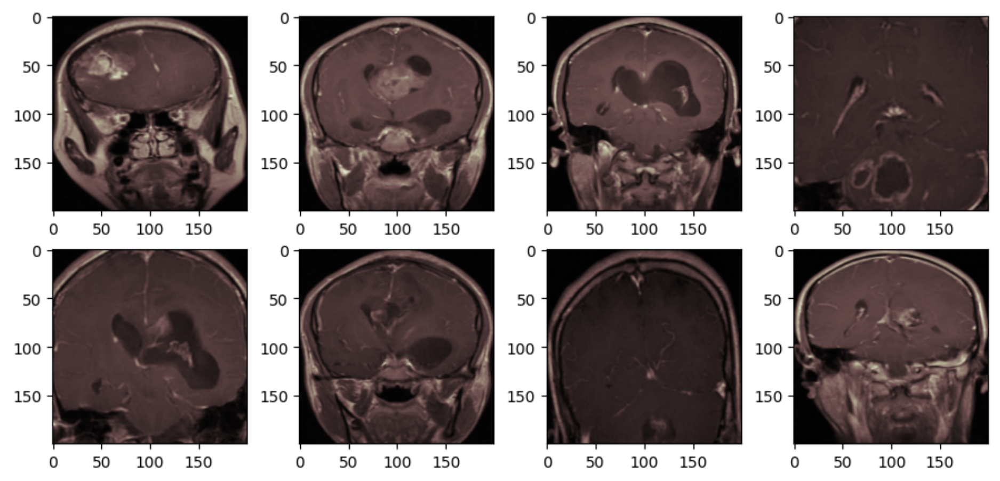
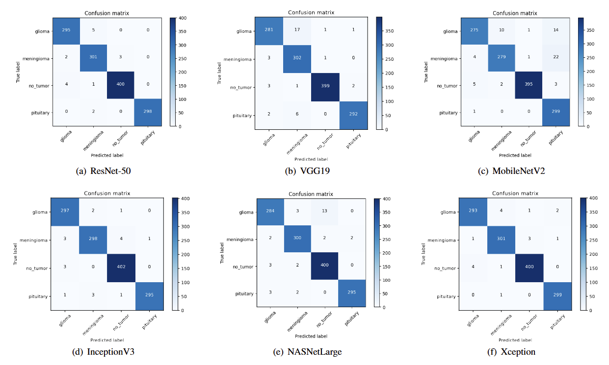
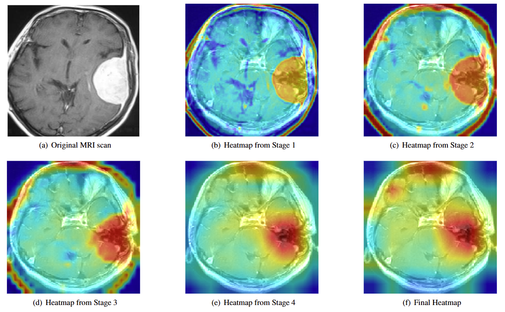
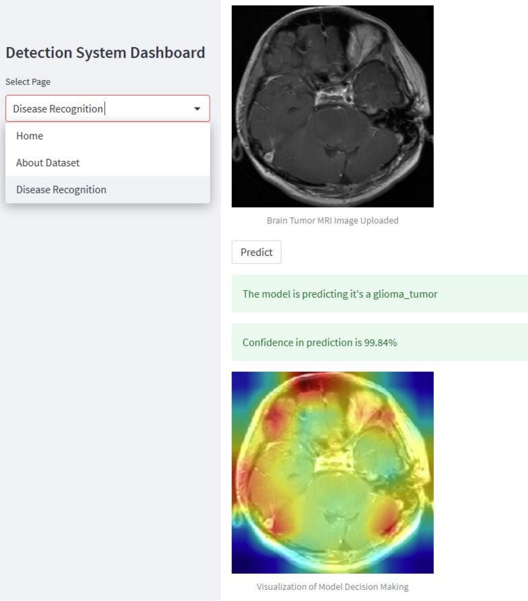

# **Empowering brain tumor diagnosis through explainable deep learning**

Brain tumors are among the most lethal diseases, and early detection is crucial for improving patient outcomes. Currently, magnetic resonance imaging (MRI) is the most effective method for early brain tumor detection due to its superior imaging quality for soft tissues. However, manual analysis of brain MRI scans is prone to errors, largely influenced by the radiologists' experience and fatigue. To address these challenges, computer-aided diagnosis (CAD) systems are increasingly significant. These systems leverage advanced computer vision techniques to provide accurate predictions based on medical images, enhancing diagnostic precision and reliability. 

This paper presents a novel CAD framework for multi-class brain tumor classification. The framework employs six pre-trained deep learning models as the base, and incorporates comprehensive data preprocessing and augmentation strategies to enhance computational efficiency. To address issues related to transparency and interpretability in deep learning models, Gradient-weighted Class Activation Mapping (Grad-CAM) is utilized to visualize the decision-making processes involved in tumor classification from MRI scans. Additionally, a user-friendly Brain Tumor Detection System has been developed using Streamlit, demonstrating its practical applicability in real-world settings and providing a valuable tool for clinicians. All simulation results are derived from a public benchmark dataset, showing that the proposed framework achieves state-of-the-art performance, with accuracy approaching 99\% in ResNet-50, Xception, and InceptionV3 models.

## **Problem Statement**

Brain tumor is the accumulation or mass growth of abnormal cells in the brain. There are basically two types of tumors, malignant and benign. Malignant tumors can be life-threatening based on the location and rate of growth. Hence timely intervention and accurate detection is of paramount importance when it comes to brain tumors. This project focusses on classifying 3 types of brain tumors based on its loaction from normal cases i.e no tumor using Convolutional Neural Network.

## Proposed Framework

  

  Structure of the proposed framework for brain tumor classifcation

The proposed framework for brain tumor classification is illustrated in the figure above. It represents a high-level overview of the process using MRI scans to classify brain tumors. The methodology includes several key steps:

1. **Dataset Acquisition**: The Brain Tumor MRI Dataset, which includes images of meningioma, glioma, and pituitary tumors, was sourced from publicly available repositories.

2. **Image Preprocessing**: To improve data quality, comprehensive image preprocessing techniques were applied. This step was crucial for enhancing the reliability of subsequent analyses.

3. **Data Partitioning and Augmentation**: The dataset was randomly divided into training, validation, and testing sets. Image augmentation techniques were exclusively applied to the training set to increase its diversity and robustness.

4. **Model Training**: Six pre-trained models—VGG19, ResNet50, Xception, MobileNetV2, InceptionV3, and NASNetLarge—were fine-tuned for the classification task. These models were initialized with pre-trained weights and adjusted to fit the specific classes (meningioma, pituitary, and glioma).

5. **Performance Evaluation**: The framework's effectiveness was evaluated using various metrics, including accuracy, specificity, sensitivity, F1-score, and confusion matrix.

6. **Interpretability**: To improve transparency, Grad-CAM was employed to visualize the decision pathways of the models. This technique provided valuable insights into how the models arrived at their predictions based on MRI scans.

## **Dataset Acquisition:**

The dataset utilized for this model is sourced from the Brain Tumor MRI Dataset available on Kaggle. It consists of MRI images categorized into different types of brain tumors and non-tumor cases.

### Categories

The dataset is divided into the following categories:

  

  Categories of the Brain Tumor MRI Dataset

### Dataset Details and Distribution

The dataset is partitioned into training, validation, and testing sets as outlined below:

| **Category**       | **Training** | **Validation** | **Testing** |
|--------------------|--------------|----------------|-------------|
| Glioma tumor       | 1,060        | 261            | 300         |
| Meningioma tumor   | 1,072        | 267            | 306         |
| Pituitary tumor    | 1,158        | 299            | 300         |
| No tumor           | 1,279        | 316            | 405         |
| **Total**          | **4,569**    | **1,143**      | **1,311**   |

This distribution ensures a comprehensive training process, effective validation, and robust testing for the model's performance evaluation.

### **Image Preprocessing**
Image preprocessing is applied to all the images in the dataset
1. Cropping the image : removes the unwanted background noise. Thus helping the algorithm to focus completely on the features of interest

  

  The cropping process of MRI scans

2.	Noise Removal : Bilateral filter is used for noise removal. It smooths the image while preserving edges and fine details. Bilateral filter considers both the spatial distance and intensity similarity between pixels when smoothing the image. Hence suitable for processing MRI images acquired with different imaging protocols and parameters.
3.	Applying colormap : Applying a colormap can improve the interpretability of MRI images by enhancing the contrast between different tissues or structures
4.	Resize : Resizing the image for standardizing the input size of images to be fed into a machine learning model

  

   The brain tumor MRI after preprocessing.

## **Data Partitioning and Augmentation**
### **Splitting the data into train, test and validation**
Here the train data is split into train and validation sets. The test data is completely unseen. There are 4569 train images, 1143 validation images an 1311 test images.

### **Image Augmentation using Image Data Generator**
Medical imaging datasets, including MRI images, are often limited in size due to factors such as data collection constraints, privacy concerns, or rarity of certain conditions. Image augmentation allows to artificially increase the size of the dataset by generating variations of existing images. Augmentation can help prevent the model from memorizing specific patterns or features in the training data that may not generalize well to unseen data, thus leading to a more robust and generalizable model.

## **Model Training**

Many adaptations and refinements have been introduced to customize the original architecture of CNNs, aiming to achieve specialized learning outcomes and enhance performance. These modifications have led to the development of various models, including Inception, Xception, ResNet, and others. In this study, six deep learning models—VGG19, InceptionV3, ResNet-50, Xception, MobileNetV2, and NASNetLarge—were selected for brain tumor classification using MRI scans. These models were chosen due to their proven effectiveness and widespread use in image classification tasks. Their diverse architectures and capabilities provide a comprehensive approach to assessing their effectiveness in the specific task of brain tumor classification

### Configuration of Hyperparameters for the Selected Models

| **Hyperparameter**           | **Configuration**           |
|------------------------------|-----------------------------|
| Learning Rate                | $1 \times 10^{-4}$          |
| Mini-Batch Size              | 32 Images                   |
| Maximum Epochs               | 25                          |
| Validation Fraction          | 20%                         |
| Dropout Probability          | 0.4                         |
| Optimization Algorithm       | Adam                        |
| Activation Function          | Softmax                     |
| Loss Function                | Categorical Cross-Entropy   |

## **Performance Evaluation**
### Model Comparison with Accuracy Metrics

| **Model**                 | **Class**   | **Precision** | **Recall** | **F1-score** | **Accuracy** |
|---------------------------|-------------|---------------|------------|--------------|--------------|
|                           | Glioma      | 0.84          | 0.99       | 0.91         |              |
| **ResNet-50**             | Meningioma  | 0.99          | 0.77       | 0.87         |              |
| **Without Augmentation**  | No-tumor    | 0.94          | 0.99       | 0.96         | **93.14%**   |
|                           | Pituitary   | 0.97          | 0.97       | 0.97         |              |
|                           | **Avg**     | **0.94**      | **0.93**   | **0.93**     |              |
|---------------------------|-------------|---------------|------------|--------------|--------------|
| **Model**                 | **Class**   | **Precision** | **Recall** | **F1-score** | **Accuracy** |
|---------------------------|-------------|---------------|------------|--------------|--------------|
|                           | Glioma      | 0.96          | 0.92       | 0.94         |              |
|                           | Meningioma  | 0.96          | 0.91       | 0.93         |              |
| **MobileNetV2**           | No-tumor    | 0.99          | 0.98       | 0.99         | **95.15%**   |
|                           | Pituitary   | 1.00          | 1.00       | 0.94         |              |
|                           | **Avg**     | **0.95**      | **0.95**   | **0.95**     |              |
|---------------------------|-------------|---------------|------------|--------------|--------------|
| **Model**                 | **Class**   | **Precision** | **Recall** | **F1-score** | **Accuracy** |
|---------------------------|-------------|---------------|------------|--------------|--------------|
|                           | Glioma      | 0.97          | 0.94       | 0.95         |              |
|                           | Meningioma  | 0.93          | 0.99       | 0.96         |              |
| **VGG19**                 | No-tumor    | 1.00          | 0.99       | 0.99         | **97.18%**   |
|                           | Pituitary   | 0.99          | 0.97       | 0.98         |              |
|                           | **Avg**     | **0.97**      | **0.97**   | **0.97**     |              |
|---------------------------|-------------|---------------|------------|--------------|--------------|
| **Model**                 | **Class**   | **Precision** | **Recall** | **F1-score** | **Accuracy** |
|---------------------------|-------------|---------------|------------|--------------|--------------|
|                           | Glioma      | 0.97          | 0.95       | 0.96         |              |
|                           | Meningioma  | 0.98          | 0.98       | 0.98         |              |
| **NASNetLarge**           | No-tumor    | 0.96          | 0.99       | 0.98         | **97.56%**   |
|                           | Pituitary   | 0.99          | 0.98       | 0.99         |              |
|                           | ** Avg**    | **0.98**      | **0.98**   | **0.98**     |              |
|---------------------------|-------------|---------------|------------|--------------|--------------|
| **Model**                 | **Class**   | **Precision** | **Recall** | **F1-score** | **Accuracy** |
|---------------------------|-------------|---------------|------------|--------------|--------------|
|                           | Glioma      | 0.98          | 0.99       | 0.98         |              |
|                           | Meningioma  | 0.98          | 0.97       | 0.98         |              |
| **InceptionV3**           | No-tumor    | 1.00          | 0.98       | 0.99         | **98.55%**   |
|                           | Pituitary   | 0.99          | 0.99       | 0.99         |              |
|                           | **Avg**     | **0.99**      | **0.99**   | **0.99**     |              |
|---------------------------|-------------|---------------|------------|--------------|--------------|
| **Model**                 | **Class**   | **Precision** | **Recall** | **F1-score** | **Accuracy** |
|---------------------------|-------------|---------------|------------|--------------|--------------|
|                           | Glioma      | 0.98          | 0.98       | 0.98         |              |
|                           | Meningioma  | 0.97          | 0.98       | 0.98         |              |
| **Xception**              | No-tumor    | 0.99          | 0.99       | 0.99         | **98.63%**   |
|                           | Pituitary   | 0.99          | 0.99       | 0.99         |              |
|                           | ** Avg**    | **0.99**      | **0.99**   | **0.99**     |              |
|---------------------------|-------------|---------------|------------|--------------|--------------|
| **Model**                 | **Class**   | **Precision** | **Recall** | **F1-score** | **Accuracy** |
|---------------------------|-------------|---------------|------------|--------------|--------------|
|                           | Glioma      | 0.98          | 0.98       | 0.98         |              |
|                           | Meningioma  | 0.97          | 0.98       | 0.98         |              |
| **ResNet-50**             | No-tumor    | 0.99          | 0.99       | 0.99         | **98.70%**   |
|                           | Pituitary   | 1.00          | 0.99       | 1.00         |              |
|                           | **Avg**     | **0.99**      | **0.99**   | **0.99**     |              |
|---------------------------|-------------|---------------|------------|--------------|--------------|

### **Confusion matrix**

  

## **Interpretability**

  

   Grad-CAM based heatmap visualization of ResNet-50 decision pathways in brain tumor classification.

## **Streamlit App**

  

## **Future work**
Despite these advancements, the current approach faces limitations due to privacy concerns associated with brain tumor MRI datasets. These privacy issues restrict the sharing of datasets and complicate the acquisition of diverse training data, which is essential for improving model robustness and generalizability. To address these issues, future research could explore federated learning (FL) techniques to enhance model accuracy and generalization while preserving patient privacy. FL would allow for the coordinated training of a unified DL model across multiple health institutions, keeping patient data localized. Additionally, integrating blockchain technology with FL could further improve the transparency and traceability of model training processes, contributing to more secure and accountable machine learning practices in healthcare.
